# Manual de Usuario

## Cómo correr el proyecto

Para instalar el juego, una vez clonado el repositorio, correr en el directorio raíz:

```bash
sudo bash ./install.sh
```

```bash
sudo chown $USER:$USER /var/duck_game/maps
```
Este último comando sirve para que el cliente, al abrir el editor desde el programa del cliente, pueda utilizar el editor y el mapa creado se pueda guardar correctamente.


Que corre los scripts para descargar las dependencias necesarias. Ante posibles causas de errores, hacer lo siguiente:


## Ejecución

Como se agregan los ejecutables de cliente, server y el editor de mapa a "usr/bin", se pueden correr desde cualquier directorio.

```bash
duck_game_server <puerto>
```

```bash
duck_game <hostname> <puerto>
```

Para correr el editor se necesita el comando de superusuario 'sudo', para que pueda guardar los mapas en el directorio /var/duck_game

```bash
sudo map_editor
```

-------------------------------------------------------------
### Manejo del editor de mapas

A continuación se detallan las referencias de las imagenes que se utilizan en el editor de mapas:


| Imagen                           | Utilización                  |
|----------------------------------|------------------------------|
| 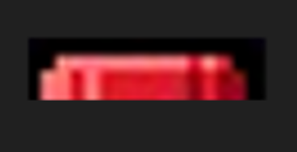 | Respawn del jugador |
| 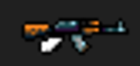 | AK47 |
| 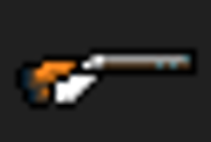 | Escopeta |
| 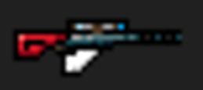 | Francotirador |
| 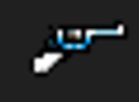 | CowboyGun |
| 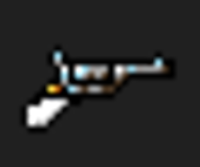 | DuelingGun |
| 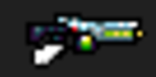 | LaserGun |
| 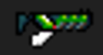 | LaserRifle |
| 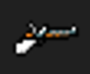 | Magnum |
| 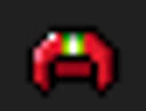 | Casco (en desarrollo) |
| 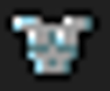 | Armadura (en desarrollo) |
| 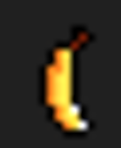 | Banana (en desarrollo) |
| 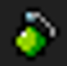 | Grenade(en desarrollo) |


